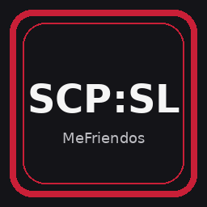

<p align="center">
  
</p>

<h1 align="center">WindowsGSM.SCPSL</h1>

<p align="center">
  MeFriendos build for running an SCP: Secret Laboratory dedicated server with WindowsGSM.
</p>

<p align="center">
  <a href="https://github.com/Raziel7893/WindowsGSM/releases/tag/v1.25.1.22"></a>
  <a href="CHANGELOG.md"></a>
  <a href="LICENSE"></a>
</p>

This plugin installs, updates, starts and stops the official SCP: Secret Laboratory Dedicated Server through SteamCMD and Northwood's LocalAdmin V2. The MeFriendos build is based on the original `WindowsGSM.SCPSL` plugin by Oscar Hurst, but the runtime handling has been rewritten for current LocalAdmin V2 behavior and the hardened MeFriendos WindowsGSM setup.

## Features

- Installs and updates the official SCP:SL Dedicated Server through SteamCMD.
- Uses SteamCMD App ID `996560` with anonymous login.
- Starts `LocalAdmin.exe` from the server root.
- Passes the WindowsGSM **Server Port** as LocalAdmin's first positional argument.
- Validates the selected port before launch.
- Prevents accidentally specifying a second positional port in **Server Start Param**.
- Supports WindowsGSM Embedded Console with LocalAdmin V2.
- Adds `--printStd`, `--noSetCursor` and `--disableTrueColor` automatically while Embedded Console is enabled.
- Sends the official LocalAdmin `exit` command for graceful shutdown before falling back to a forced kill.
- Keeps SCP:SL server data inside `serverfiles\AppData` instead of the Windows user profile.
- Uses Northwood's own `gamedir_for_configs: true` hoster mode.
- Removes unrestricted Windows Firewall application exceptions for the exact `LocalAdmin.exe` and `SCPSL.exe` paths before startup.
- Leaves narrow manually configured UDP port rules untouched.
- Does **not** automatically accept Northwood's EULA.
- Is ready for the official LabAPI framework bundled with current dedicated-server builds.

## Quick overview

| Setting | Value |
| --- | --- |
| SteamCMD App ID | `996560` |
| SteamCMD login | Anonymous |
| Start executable | `LocalAdmin.exe` |
| Game executable | `SCPSL.exe` |
| Default game port | `7777/UDP` |
| Port increment | `1` |
| Default max players | `20` |
| Embedded Console | Supported through LocalAdmin V2 |
| Local server data | `serverfiles\AppData` |
| Mod framework | LabAPI bundled by Northwood |
| Firewall | Manual UDP port rules only |

## Requirements

- Raziel7893/WindowsGSM v1.25.1.22 or a compatible WindowsGSM build
- 64-bit Windows supported by the installed SCP:SL Dedicated Server build
- Microsoft .NET Framework 4.8 and the current Visual C++ Redistributable required by SCP:SL
- Administrator rights for WindowsGSM when the MeFriendos firewall hardening needs to remove broad application exceptions

## Plugin installation

1. Download the release archive.
2. Extract the complete `SCPSL.cs` folder into `<WindowsGSM>\plugins\`.
3. Click **Reload Plugins** or restart WindowsGSM.
4. Add **SCP: Secret Laboratory Dedicated Server** and click **Install**.
5. Keep `7777` as **Server Port** or choose another unused UDP port.
6. Start the server once and review/accept Northwood's EULA yourself when LocalAdmin asks.
7. Configure the generated SCP:SL files below the instance-local `serverfiles\AppData` directory.
8. Create a narrow inbound UDP firewall rule for the selected game port.

The default **Server Start Param** is:

```text
--useDefault
```

`--useDefault` avoids the LocalAdmin configuration wizard when no LocalAdmin config exists. It does **not** accept the SCP:SL EULA.

## Server data

The plugin automatically creates:

```text
<WindowsGSM>\servers\<server ID>\serverfiles\AppData\
```

and makes sure `serverfiles\hoster_policy.txt` contains:

```text
gamedir_for_configs: true
```

This is Northwood's native hoster mode, so no junction or Windows profile redirection is needed.

For server ID `12`, the path is:

```text
F:\WindowsGSM\servers\12\serverfiles\AppData\
```

Main gameplay config:

```text
<WindowsGSM>\servers\<server ID>\serverfiles\AppData\config\<port>\config_gameplay.txt
```

WindowsGSM's **Server Name** field is only the WindowsGSM instance label. SCP:SL's actual browser name is controlled by `server_name` in `config_gameplay.txt`.

## Ports and firewall

Default:

| Purpose | Protocol | Port |
| --- | --- | --- |
| SCP:SL game traffic | UDP | `7777` |

The plugin removes broad Windows Firewall application exceptions for the exact paths of `LocalAdmin.exe` and `SCPSL.exe`. Existing targeted port rules are not touched.

## Embedded Console

When **Embed Console** is enabled in WindowsGSM, the plugin automatically adds:

```text
--printStd --noSetCursor --disableTrueColor
```

Your own **Server Start Param** is appended afterwards. Existing flags are not duplicated.

## EULA

The plugin intentionally does not add LocalAdmin's `--acceptEULA` flag. Accept the SCP:SL EULA yourself before using any non-interactive acceptance option.

## Graceful shutdown

The plugin first sends LocalAdmin's official `exit` command and waits for shutdown. `Process.Kill()` is only used as a last resort.

## LabAPI / plugins

Current SCP:SL Dedicated Server builds include Northwood's official **LabAPI** framework. This plugin does not download or modify LabAPI itself.

With local server data enabled, LabAPI uses:

```text
<WindowsGSM>\servers\<server ID>\serverfiles\AppData\SCP Secret Laboratory\LabAPI\
```

## Testing checklist

- WindowsGSM loads `SCPSL.cs` without a plugin error.
- Install and Update complete through SteamCMD App ID `996560`.
- `LocalAdmin.exe` and `SCPSL.exe` exist after installation.
- Invalid or empty Server Port values are rejected.
- A second positional port in Server Start Param is rejected.
- LocalAdmin starts with the selected WindowsGSM Server Port as its first argument.
- `serverfiles\AppData` is a normal directory, not a junction.
- `serverfiles\hoster_policy.txt` contains `gamedir_for_configs: true`.
- SCP:SL no longer writes its normal server data into the Windows user's roaming AppData directory.
- With Embed Console enabled, LocalAdmin output is visible in WindowsGSM.
- Stop sends `exit` before any forced termination.
- No broad LocalAdmin.exe or SCPSL.exe application firewall exception remains after startup.

## Project links

- Source: https://github.com/PapaGordon/WindowsGSM.SCPSL-MeFriendos
- Original WindowsGSM plugin: https://github.com/Voidoz/WindowsGSM.SCPSL
- SCP:SL technical wiki: https://techwiki.scpslgame.com/
- LocalAdmin V2: https://github.com/northwood-studios/LocalAdmin-V2
- LabAPI: https://github.com/northwood-studios/LabAPI
- WindowsGSM: https://github.com/Raziel7893/WindowsGSM
- Community: https://mefriendos.de

This is an independent community plugin. It is not affiliated with or endorsed by Northwood Studios, SCP: Secret Laboratory, WindowsGSM, Oscar Hurst, or any third-party plugin developer.

## License

The original WindowsGSM.SCPSL plugin by Oscar Hurst was released under the MIT License. The original copyright and permission notice are retained in [LICENSE](LICENSE), together with the MeFriendos modification notice.
